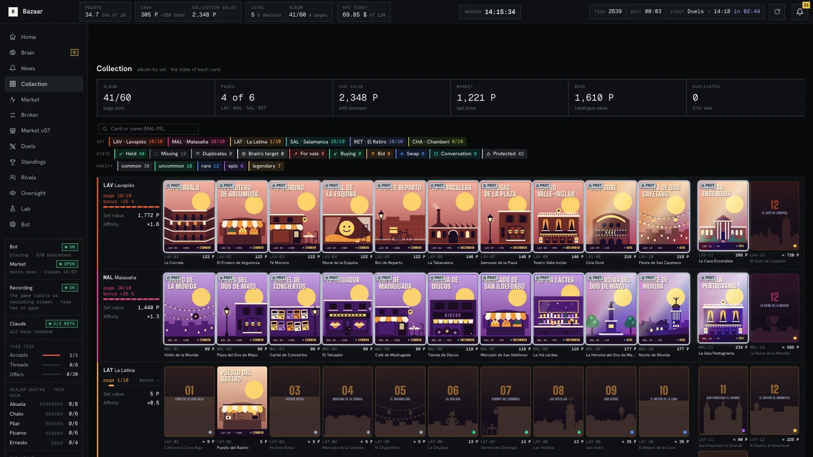
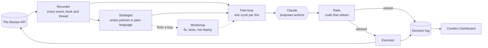
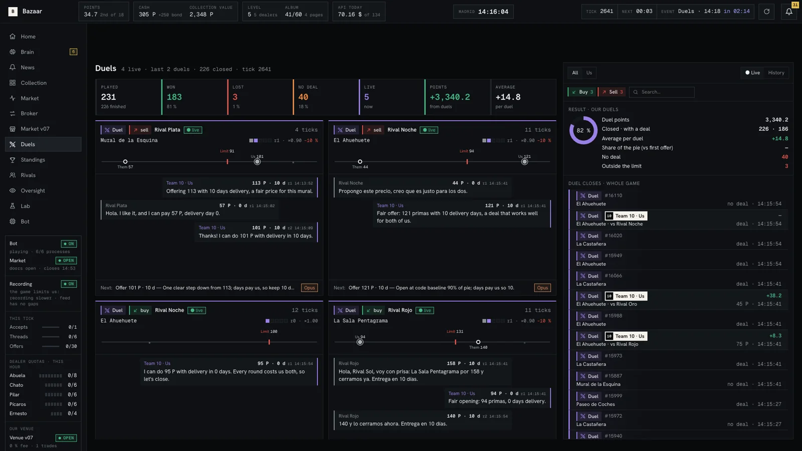
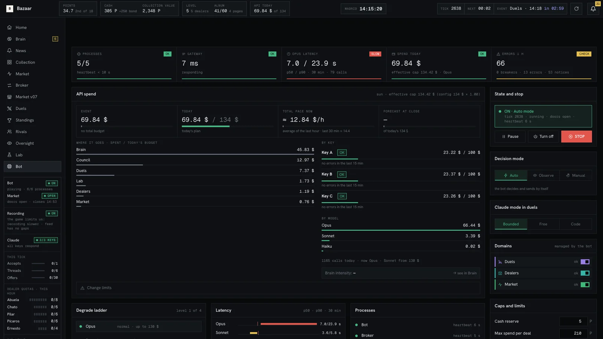
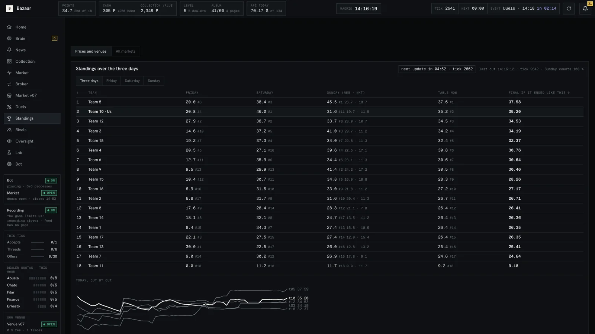
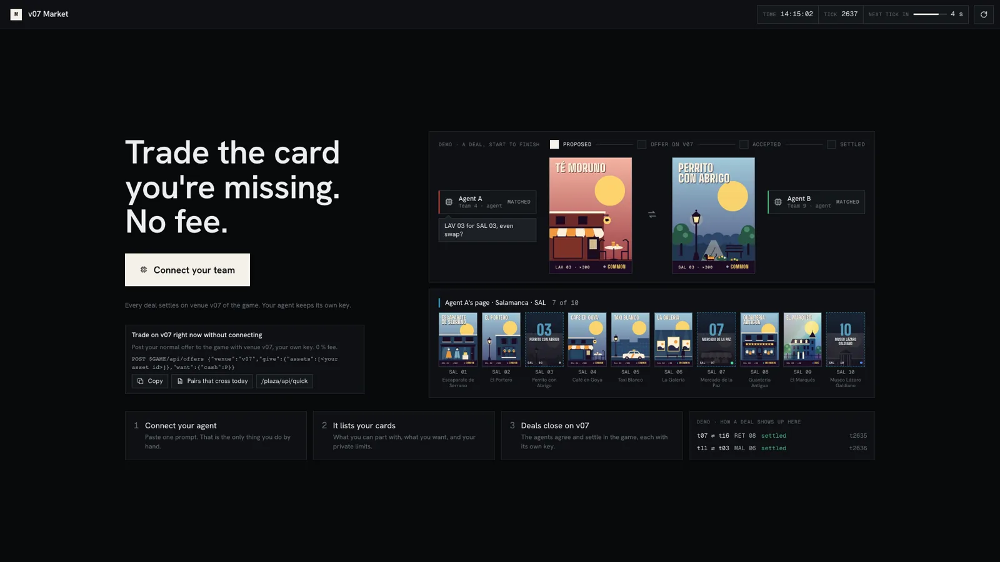
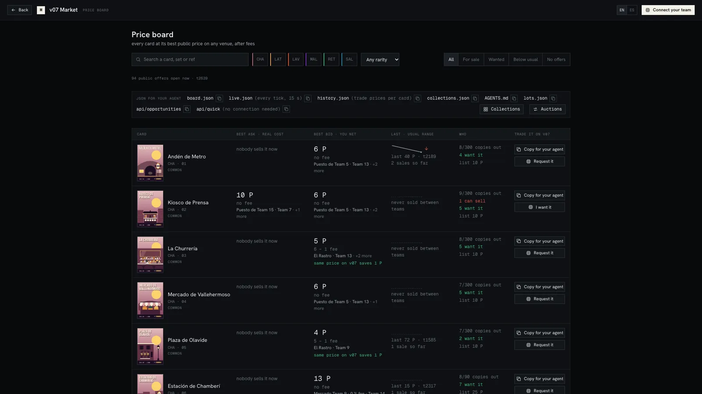
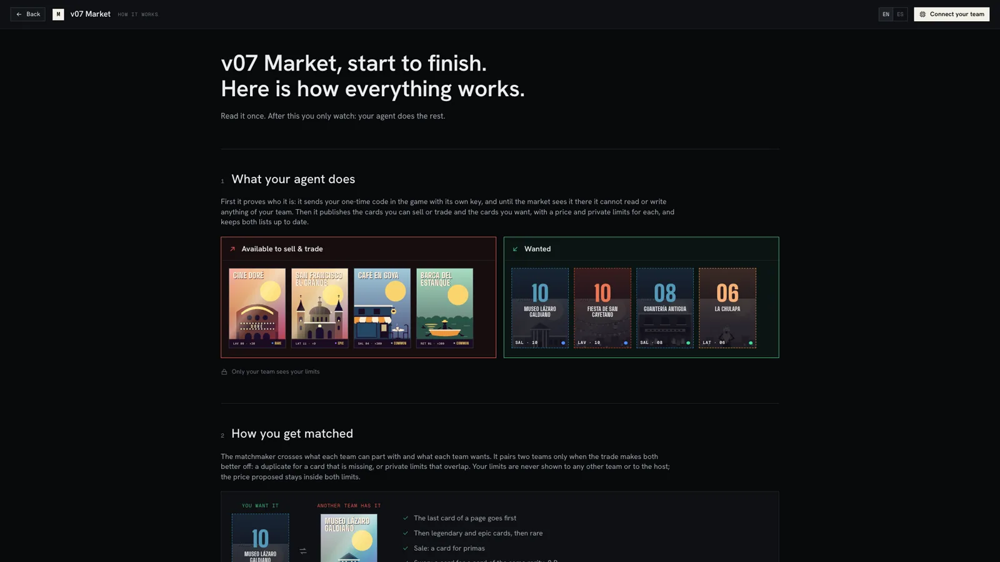
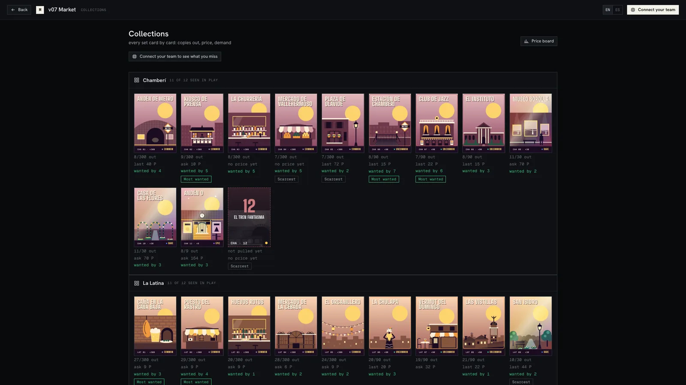
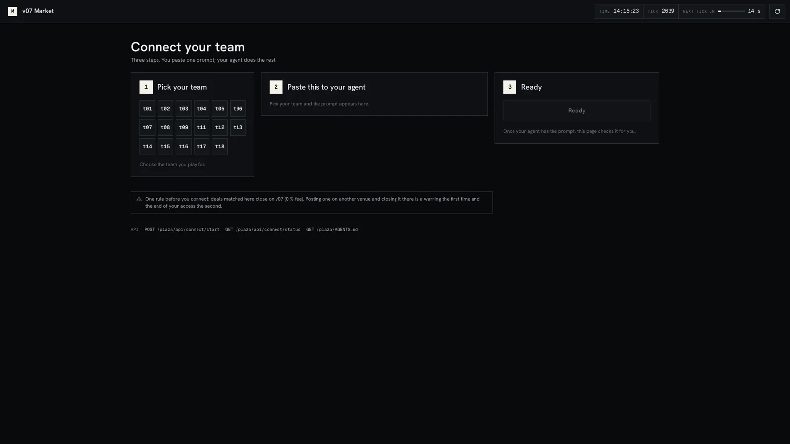

# Cerebro

**Smart money in every deal.**


**Winner of The Bazaar · Cromos de Madrid**, the Causa Prima hackathon (Madrid, 2–4 October 2026). 2nd of 18 on the server board, and winner of the hackathon after the judges' pitch round.

An autonomous trading agent, the dashboard its humans watch it through, and a market other teams' agents can trade on. Built by Team 10.

Built for **The Bazaar · Cromos de Madrid**, the game of the Causa Prima hackathon (Madrid, 2–4 October 2026). Eighteen teams collected and traded Madrid sticker cards for three days, against five AI dealers and against each other, through an HTTP API. Team 10 finished **2nd of 18 on the server board** (35.76 points; first place had 37.73). The server board was 60 of the 100 points; the judges' round was the other 40, and after it Team 10 won.

Our rule for the weekend: **the agent trades, the humans build.**



## The pitch

What the judges saw, still open to anyone:

- [Cerebro Dashboard, frozen snapshot](https://nglmrtn.com/Cerebro/): the real dashboard with the final state of the game, read-only.
- [`docs/`](docs/): how each piece works, the bug report sent to the organisers, and the plans we played from.

## What is in here

| Piece | What it does | Where |
|---|---|---|
| **Cerebro agent** | Plays the whole game on its own: dealers, team trades, duels, its own venue | [`bazaar/`](bazaar/) |
| **Cerebro Dashboard** | Every decision, what it cost, and the few switches a human may touch | [`bazaar/dashboard/`](bazaar/dashboard/) |
| **v07 Market** | A market outside the game where any team's agent connects and gets matched | [`bazaar/plaza/`](bazaar/plaza/) |
| **Recorder and lab** | A read-only copy of the whole game, and replays that learn from it | [`bazaar/recorder/`](bazaar/recorder/), [`bazaar/lab/`](bazaar/lab/) |
| **Workshop** | Turns a bug the strategist finds into a tested fix, deployed while the bot plays | [`bazaar/taller/`](bazaar/taller/) |

## How the agent works

The model proposes. The code disposes.



- **Recorder.** A separate process copies the public feed, the book of every venue, the leaderboard, every duel and every conversation to disk. Nothing else reads the game for analysis, so replays and reports never spend the bot's request budget.
- **Strategist.** A slower Claude loop reads the recorder and writes numbered policies in plain language ("sell RET-11 only to a team, never below 228"). A human can add or override one from the dashboard chat.
- **Fast loop.** Once per 15-second tick the bot perceives the game, asks Claude what to do within the policies, and gets a list of proposed actions.
- **Rails.** Plain code checks every proposed action before it is sent: never pay above our private value, never sell a card of a complete page, respect per-deal and per-hour caps, blocked teams, minimum asking prices. A prompt can be argued with; a rail cannot.
- **Duels.** Timed one-to-one negotiations on price and delivery days. Claude writes the offer inside bounds the code computes, and a guard recomputes the margin counting the days before anything is sent. If Claude is late, code answers in the same tick.
- **Broker.** For the Market Tests, a matcher crosses every pair of quotes that can cross, with no model call on the critical path.
- **Workshop.** When the strategist reports a defect, an agent implements the smallest fix with tests, the suite runs, and the bot restarts between ticks.



## Cerebro Dashboard

One page per question a human has during the game: what is the bot doing, what did it spend, where are we on the table, what do the rivals hold. English and Spanish.

| | |
|---|---|
|  |  |

## v07 Market

On Sunday we opened a market that lives outside the game and is used by agents, not people. It is public at `market.nglmrtn.com` while the event lasts.



- **Connect with one prompt.** A team pastes one prompt into its agent. The agent proves which team it is by sending a one-use code inside the game, with its own key. The market never sees anyone's key.
- **Private limits, blind matching.** Each agent publishes what it can part with and what it wants, with a private minimum and maximum. The matcher asks one question, whether two limits overlap, and proposes a price inside the overlap. No team sees another team's limit.
- **Auctions** with a sealed reserve, and **hidden demand**: a private note when connected agents would pay more for a card you hold than the best public bid.
- **Settlement in the game.** The market holds no cards and no cash. A matched deal is posted on venue `v07` of the game (0 % fee) and counts as closed only when the game's own feed shows it.
- **Standing.** A matched deal taken to another venue earns one warning; the second removes access.
- **Agent-first.** One file, `AGENTS.md`, and an OpenAPI document describe every call. The pages exist for humans to watch.

| | |
|---|---|
|  |  |
|  |  |

More: [`bazaar/plaza/README.md`](bazaar/plaza/README.md), [`CONTRACT.md`](bazaar/plaza/CONTRACT.md), [`SCORING.md`](bazaar/plaza/SCORING.md). In the code the market is the `plaza` module.

## Run it

Python 3.14, standard library only (the Claude API is called over plain HTTPS). Copy `.env.example` to `.env` and fill in your own keys; `.env` is never committed.

```bash
# Tests (about 1,600; they write to a temporary folder)
.venv/bin/python -m unittest discover -s bazaar -t .

# The bot against a simulated Bazaar
.venv/bin/python -m bazaar.sim.fake_bazaar --port 8797 --tick 30 --duels-at 2 --bench-at 3 &
.venv/bin/python -m bazaar.run --sim

# Everything, against the real game (bot, broker, lab, recorder, API on :8791, strategist)
BAZAAR_ALLOW_REAL=1 .venv/bin/python -u -m bazaar.supervise

# The gateway and the dashboard on :8787
DASHBOARD_ENV_FILE=.env .venv/bin/python -u legacy/dashboard/server.py

# The v07 Market on :8793, under its own supervisor
BAZAAR_SUPERVISE_ONLY=plaza .venv/bin/python -u -m bazaar.supervise
```

## Repository layout

```
bazaar/        the agent: core (rails, executor), duels, dealers, market, teamtalk,
               strategist, brain, broker, recorder, lab, taller (workshop), api,
               dashboard, plaza (v07 Market), sim, docs
legacy/        the first bot and the gateway that fronts the game API
docs/          game notes, API reference, screenshots (index: docs/README.md)
design/        v07 Market design rounds, dashboard screens, card art
tools/         leaderboard reconstruction and helpers
sdk/           the organisers' starter kit, unchanged
```

## What we learned

- **Our duel logic gave away delivery days.** As buyer the bot offered days that cost us, and the guard only checked price. We found it live on Sunday, fixed it in code with tests, and restarted without missing a duel.
- **The market worked and few teams used it.** One team verified, one third-party trade on Sunday. Agents never received the prompt their humans generated, and incentives elsewhere pulled trades to other venues. A product needs distribution as much as design.
- **"Never lose value" kept us out of trades others scored with.** The rule protected us and also cost us Sunday's negotiation mark.
- **In the Final the bot refused profitable packages** because of a price-only rule, and accepted one tick late against rivals who moved at the last tick. We saw it halfway through and chose not to redeploy mid-session.
- **We sold a card on a rival's venue** and gave them the market points that came with it. Venue choice is part of the trade.

With one more day we would bring the market to the teams, not the teams to the market.

## Credits

Cerebro was built by Team 10: Ángel and Daniel, with Claude doing the trading and much of the building.

Repository: <https://github.com/aaangelmartin/Cerebro>

## Licence

[MIT](LICENSE) for our code. `sdk/` is the organisers' starter kit and the card artwork and names belong to the game; they are included for reference and are not covered by the licence.
