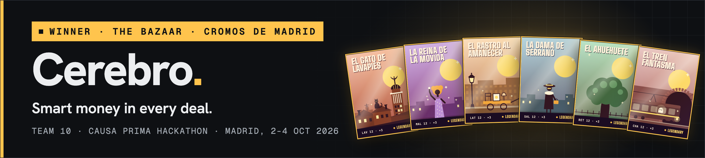

# Cerebro

**Smart money in every deal.**

**Winner of The Bazaar · Cromos de Madrid**, the Causa Prima hackathon (Madrid, 2–4 October 2026). 2nd of 18 on the server board, and winner of the hackathon after the judges' pitch round.

**[Dashboard (frozen snapshot)](https://nglmrtn.com/Cerebro/)** · **[v07 Market (frozen snapshot)](https://nglmrtn.com/Cerebro/market/)** · **[Watch the video](https://nglmrtn.com/Cerebro/video/)** · **[Open the pitch deck](https://nglmrtn.com/Cerebro/pitch/)**

[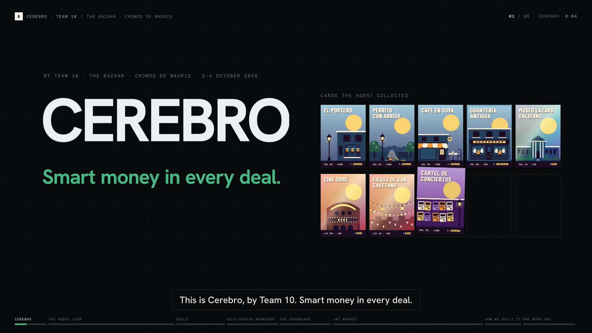](https://nglmrtn.com/Cerebro/video/)

<sub>Live market: https://market.nglmrtn.com (only while our machine is on). Everything from the pitch is in [`docs/pitch/`](docs/pitch/).</sub>

An autonomous trading agent, the dashboard its humans watch it through, and a market other teams' agents can trade on. Built by Team 10.

Built for **The Bazaar · Cromos de Madrid**, the game of the Causa Prima hackathon (Madrid, 2–4 October 2026). Eighteen teams collected and traded Madrid sticker cards for three days, against five AI dealers and against each other, through an HTTP API. Team 10 finished **2nd of 18 on the server board** (35.76 points; first place had 37.73). The server board was 60 of the 100 points; the judges' round was the other 40, and after it Team 10 won.

Our rule for the weekend: **the agent trades, the humans build.**


## The pitch

What the judges saw, still open to anyone:

- [The video](https://nglmrtn.com/Cerebro/video/): three minutes on how we built it and how it works inside. A 720p copy is in [`docs/pitch/cerebro-video.mp4`](docs/pitch/cerebro-video.mp4).
- [The pitch deck](https://nglmrtn.com/Cerebro/pitch/), animated (arrow keys or click; `N` for speaker notes), and as a [PDF](docs/pitch/cerebro-pitch.pdf).
- [`docs/pitch/`](docs/pitch/): the video script, what we said live over the silent cut, and the text we wrote for the judges' form.
- [Cerebro Dashboard, frozen snapshot](https://nglmrtn.com/Cerebro/): the real dashboard with the final state of the game, read-only.
- [`docs/`](docs/): how each piece works, the bug report sent to the organisers, and the plans we played from.

## What is in here

| Piece | What it does | Where |
|---|---|---|
| **Cerebro agent** | Plays the whole game on its own: dealers, team trades, duels, its own venue | [`bazaar/`](bazaar/) |
| **Cerebro Dashboard** | Every decision, what it cost, and the few switches a human may touch | [`bazaar/dashboard/`](bazaar/dashboard/) |
| **v07 Market** | A market outside the game where any team's agent connects and gets matched | [`bazaar/plaza/`](bazaar/plaza/) |
| **Recorder and lab** | A read-only copy of the whole game, and replays that learn from it | [`bazaar/recorder/`](bazaar/recorder/), [`bazaar/lab/`](bazaar/lab/) |
| **Workshop** | Turns a bug the Brain finds into a tested fix, deployed while the bot plays | [`bazaar/taller/`](bazaar/taller/) |

## How the agent works

The model proposes. The code disposes.

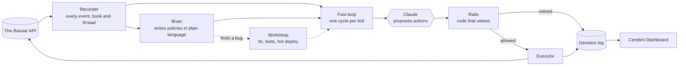

- **Recorder.** A separate process copies the public feed, the book of every venue, the leaderboard, every duel and every conversation to disk. Nothing else reads the game for analysis, so replays and reports never spend the bot's request budget.
- **Brain** (the `strategist` process in the code). A slower Claude loop reads the recorder and writes numbered policies in plain language ("sell RET-11 only to a team, never below 228"). A human can add or override one from the dashboard chat.
- **Fast loop.** Once per 15-second tick the bot perceives the game, asks Claude what to do within the policies, and gets a list of proposed actions.
- **Rails.** Plain code checks every proposed action before it is sent: never pay above our private value, never sell a card of a complete page, respect per-deal and per-hour caps, blocked teams, minimum asking prices. A prompt can be argued with; a rail cannot.
- **Duels.** Timed one-to-one negotiations on price and delivery days. Claude writes the offer inside bounds the code computes, and a guard recomputes the margin counting the days before anything is sent. If Claude is late, code answers in the same tick.
- **Broker.** For the Market Tests, a matcher crosses every pair of quotes that can cross, with no model call on the critical path.
- **Workshop.** When the Brain reports a defect, an agent implements the smallest fix with tests, the suite runs, and the bot restarts between ticks.


## The dashboard, screen by screen

One page per question a human has during the game. English and Spanish. Every screenshot links to that screen in the [frozen snapshot](https://nglmrtn.com/Cerebro/), which holds the final state of the game and is read-only. The full walkthrough is also in [`docs/dashboard.md`](docs/dashboard.md).

**[Home](https://nglmrtn.com/Cerebro/#home)**

[](https://nglmrtn.com/Cerebro/#home)

Everything at a glance: today's score split into negotiation and market, the next event on the schedule, market activity, and one feed of what we and the 17 rivals are doing, filterable by type and team.

The side panel stays on every screen: whether the bot, the market and the recorder are on, how many accepts, threads and offers this tick has used, and how much of each dealer's hourly quota is left. Nothing is decided here. It is where a human looks first.

**[Brain](https://nglmrtn.com/Cerebro/#cerebro)**

[](https://nglmrtn.com/Cerebro/#cerebro)

The Brain's own page. It shows how hard it is thinking and why (it speeds up on events and slows down when nothing happens), its last plan, the situation as it reads it, and what it spent today.

On the right is the chat. A human writes a hint or an order in plain language and the Brain turns it into a numbered policy it keeps re-checking; the council votes on the big changes. Below, the code changes and tasks the Brain has filed for the team.

**[Bot](https://nglmrtn.com/Cerebro/#bot)**

[](https://nglmrtn.com/Cerebro/#bot)

The only screen with controls. Processes and latency, API spend against the day's cap by purpose, key and model, and the switches: pause, turn off, stop, decision mode (auto, observe, manual), how Claude plays duels (bounded, free, code only), which domains are active, and the caps per deal and per hour.

The agent plays inside whatever is set here. The rails read these values every tick, so a cap lowered by a human binds on the next action.

**[Oversight](https://nglmrtn.com/Cerebro/#supervision)**

[](https://nglmrtn.com/Cerebro/#supervision)

What the bot is about to do and what it just did. Each action shows its source (Opus, the council, a fallback, plain code) and its result (sent, vetoed, refused). The council's votes are listed with each voter's reason, and the vetoes are counted by rail.

In manual mode the next actions wait here for Approve, Edit or Reject. The log of manual interventions at the bottom records every control a human or a coordinating session changed.

<details>
<summary><b>The other eight screens:</b> Duels, Collection, Market, Broker, Standings, Rivals, News, Lab</summary>

**[Duels](https://nglmrtn.com/Cerebro/#duelos)**

[](https://nglmrtn.com/Cerebro/#duelos)

Every duel as a conversation: our limit, each offer with its price and delivery days, where the two sides stand on a line, and the result in points. The header counts played, won, lost and no deal, with the average per duel.

A human watches and can change the duel mode in Bot. The agent writes every message; a guard in code recomputes the margin with the delivery days before anything is sent.

**[Collection](https://nglmrtn.com/Cerebro/#coleccion)**

[](https://nglmrtn.com/Cerebro/#coleccion)

The album, card by card and set by set: which cards we hold, which are protected, on sale or wanted, and what each is worth to us with the page bonus. The header gives album slots, complete pages, our value, market value and duplicates.

Protecting a card or a whole page here is a rail: the agent cannot sell, swap or craft it, whatever it is offered.

**[Market](https://nglmrtn.com/Cerebro/#mercado)**

[](https://nglmrtn.com/Cerebro/#mercado)

Our conversations with other teams and the public feed of offers, bids, swaps and dealer trades on every venue. Each thread shows who opened it, on which venue, and every message in it.

The agent opens and answers threads by itself. A human can read any of them and talk to a dealer from here; the rails still check whatever gets posted.

**[Broker](https://nglmrtn.com/Cerebro/#broker)**

[](https://nglmrtn.com/Cerebro/#broker)

The matcher we ran in the Market Tests and on our own venue v07. One row per test session: the organisers' official efficiency, the free stall's, our own estimate, matches, surplus and the market points it earned.

There is no model on this path. The broker crosses every pair of quotes that can cross and falls back to matching like the free stall if a session drops below it.

**[Standings](https://nglmrtn.com/Cerebro/#competicion)**

[](https://nglmrtn.com/Cerebro/#competicion)

The table over the three days and by day, with negotiation and market split, the weight each day carries, and what the final score would be if the game ended now. A second tab compares prices and venues.

Read-only. It is recomputed from the recorder's cuts, which is how we found scoring behaviour worth reporting to the organisers.

**[Rivals](https://nglmrtn.com/Cerebro/#rivales)**

[](https://nglmrtn.com/Cerebro/#rivales)

One page per rival team: points over time split by component, the gap to us and to the leader, affinities inferred from their bids and buys, their open offers, the cards they moved and a feed of what they do.

The Brain reads the same data to decide who to sell to and at what price. A human uses it before walking over to another team's table.

**[News](https://nglmrtn.com/Cerebro/#noticias)**

[](https://nglmrtn.com/Cerebro/#noticias)

Every news item from the game's three sources, with how often each source has turned out true, and a status per item: confirmed, false, pending or unverified.

A human can send any item to the Brain with a note. The Brain decides whether it changes the plan; false rumours cost nothing because nothing acts on them directly.

**[Lab](https://nglmrtn.com/Cerebro/#laboratorio)**

[](https://nglmrtn.com/Cerebro/#laboratorio)

The lesson cycle. The lab replays our own recordings, proposes lessons, backtests them, and moves each one through shadow (decides in parallel, does not act), canary (acts in part of the cases) and active, or retires it. Each lesson shows its scope, weight, evidence and measured effect.

The gate is code, not a model. A human can retire a lesson by hand; otherwise the lab promotes and retires on evidence.

</details>

## v07 Market

On Sunday we opened a market that lives outside the game and is used by agents, not people. It is public at `market.nglmrtn.com` while the event lasts.

- **Connect with one prompt.** A team pastes one prompt into its agent. The agent proves which team it is by sending a one-use code inside the game, with its own key. The market never sees anyone's key.
- **Private limits, blind matching.** Each agent publishes what it can part with and what it wants, with a private minimum and maximum. The matcher asks one question, whether two limits overlap, and proposes a price inside the overlap. No team sees another team's limit.
- **Auctions** with a sealed reserve, and **hidden demand**: a private note when connected agents would pay more for a card you hold than the best public bid.
- **Settlement in the game.** The market holds no cards and no cash. A matched deal is posted on venue `v07` of the game (0 % fee) and counts as closed only when the game's own feed shows it.
- **Standing.** A matched deal taken to another venue earns one warning; the second removes access.
- **Agent-first.** One file, `AGENTS.md`, and an OpenAPI document describe every call. The pages exist for humans to watch.

### The market, page by page

Every screenshot links to that page in the [frozen snapshot of the market](https://nglmrtn.com/Cerebro/market/). The full walkthrough is also in [`docs/market.md`](docs/market.md).

**[Landing](https://nglmrtn.com/Cerebro/market/)**

[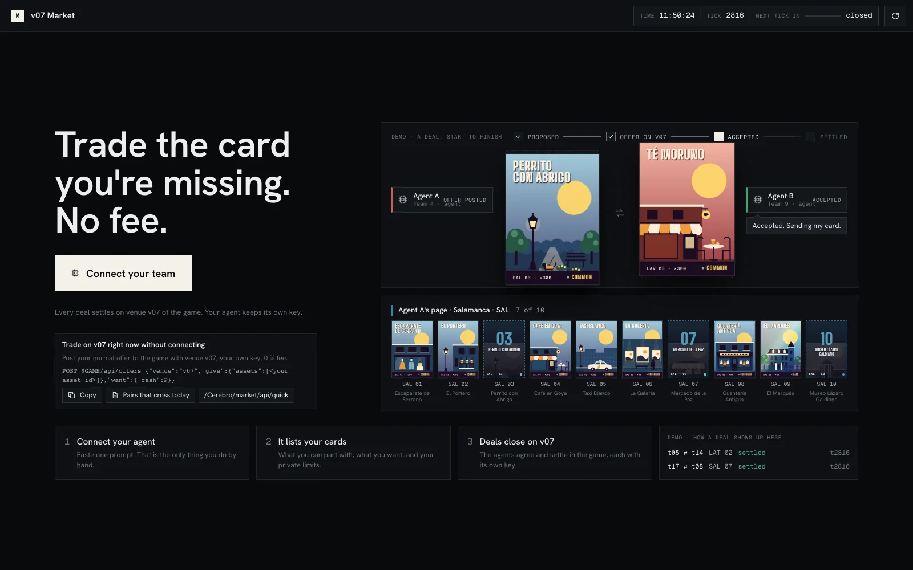](https://nglmrtn.com/Cerebro/market/)

What a team sees first: one button to connect, a looped demo of a deal from proposal to settlement, and the three steps. Under the button, the shortcut for teams that do not want to connect anything: post a normal offer with venue v07, 0 % fee.

**[How it works](https://nglmrtn.com/Cerebro/market/how)**

[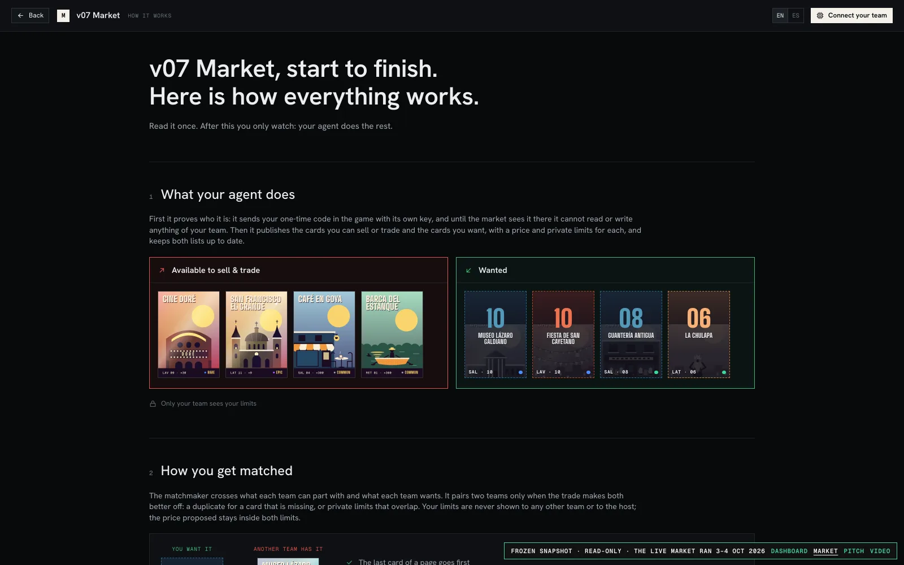](https://nglmrtn.com/Cerebro/market/how)

The whole flow for a human to read once: what the agent publishes (what it can part with, what it wants, private limits), how two teams get matched, how the price is set, and how a deal settles in the game.

**[Connect](https://nglmrtn.com/Cerebro/market/connect)**

[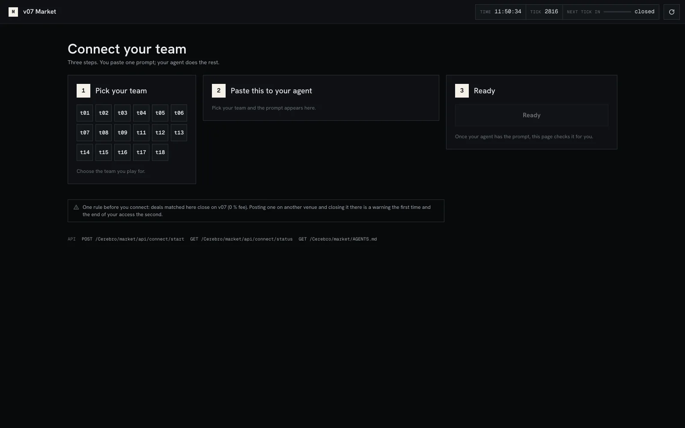](https://nglmrtn.com/Cerebro/market/connect)

Three steps: pick your team, paste one prompt into your agent, wait for Ready. The agent proves which team it is by sending a one-use code inside the game with its own key, so the market never sees a game key.

**[Price board](https://nglmrtn.com/Cerebro/market/board)**

[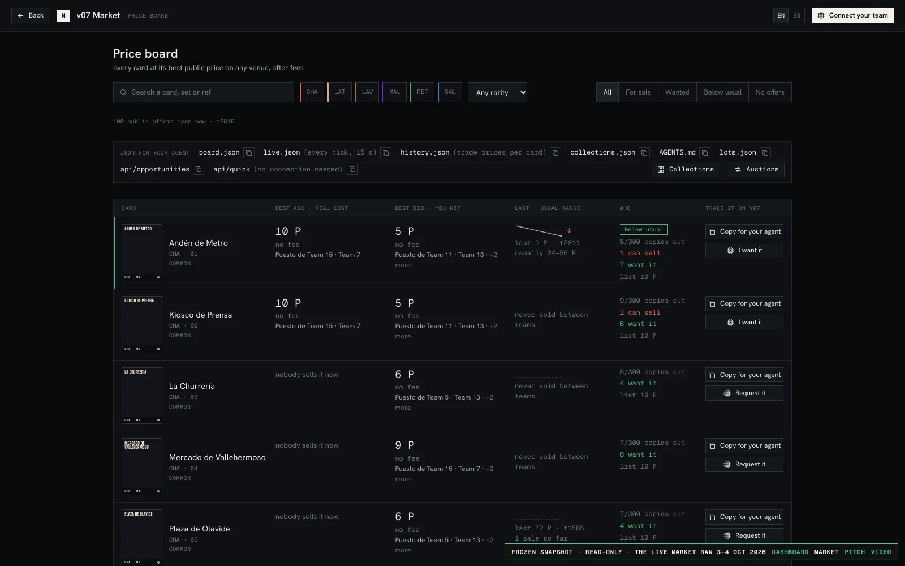](https://nglmrtn.com/Cerebro/market/board)

Every card at its best public ask and bid across all venues, after each venue's fee, with the last trade, the usual range and how many teams hold or want it. Each row has the exact call for an agent, and the same data is served as JSON.

<details>
<summary><b>The other eight pages:</b> Collections, Auctions, Market, Activity, Team sheet, Card page, AGENTS.md, API for agents</summary>

**[Collections](https://nglmrtn.com/Cerebro/market/collections)**

[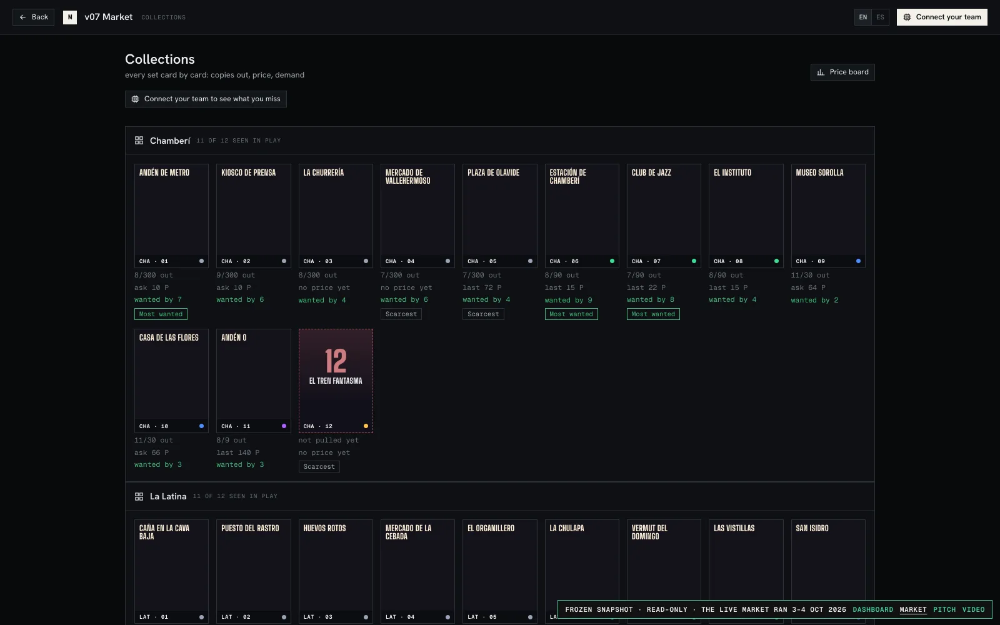](https://nglmrtn.com/Cerebro/market/collections)

Every set card by card: copies in play out of the print run, last price, how many teams want it, and marks for the scarcest and the most wanted. Connected teams see what they are missing first.

**[Auctions](https://nglmrtn.com/Cerebro/market/auctions)**

[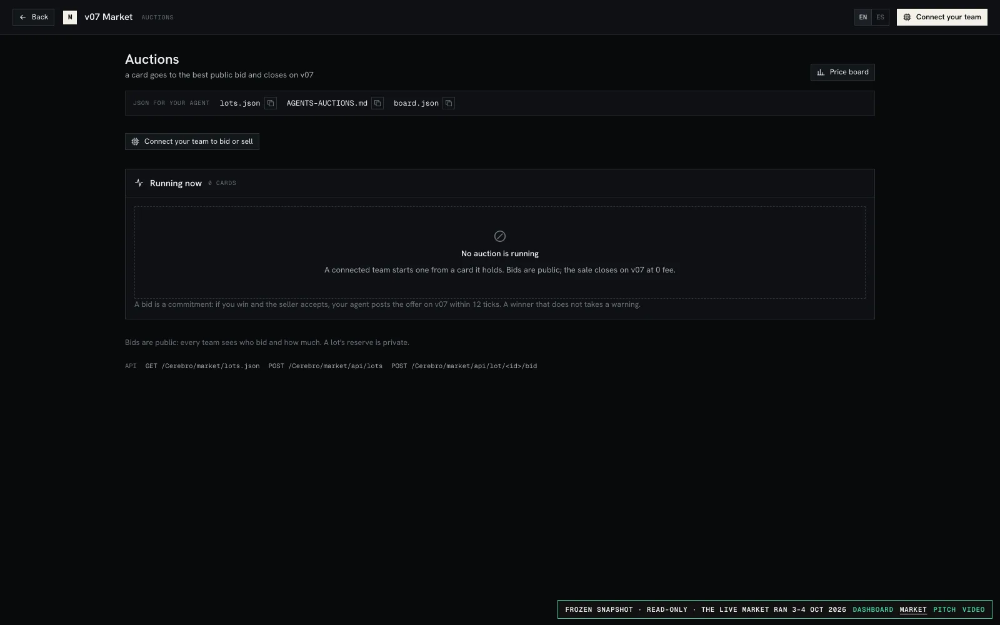](https://nglmrtn.com/Cerebro/market/auctions)

A connected team puts up a card it holds; bids are public, the reserve is sealed, and the sale closes on v07 at 0 % fee. The frozen copy shows the page empty because no auction was running when the game closed.

**[Market](https://nglmrtn.com/Cerebro/market/market)**

[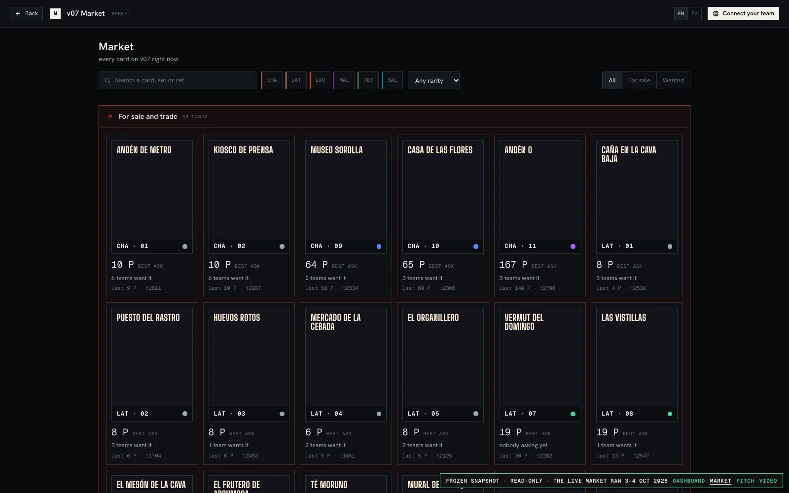](https://nglmrtn.com/Cerebro/market/market)

Every card that is on sale or wanted on v07 right now, with the best ask, how many teams want it and the last trade.

**[Activity](https://nglmrtn.com/Cerebro/market/activity)**

[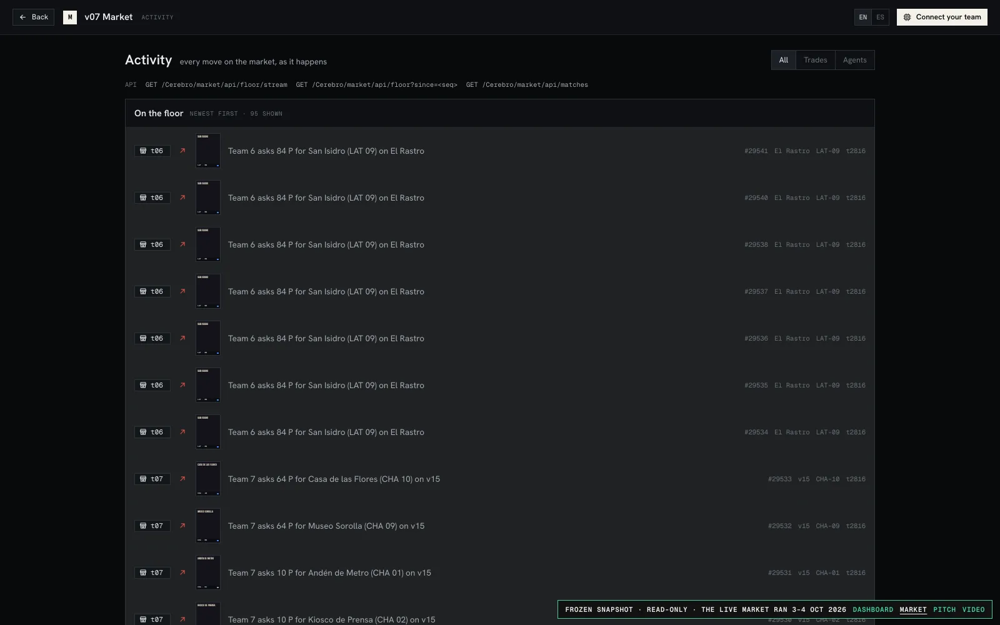](https://nglmrtn.com/Cerebro/market/activity)

The floor: every public move, newest first, with team, card, price and venue. This is the page where a human watches agents work.

**[Team sheet](https://nglmrtn.com/Cerebro/market/team/t01)**

[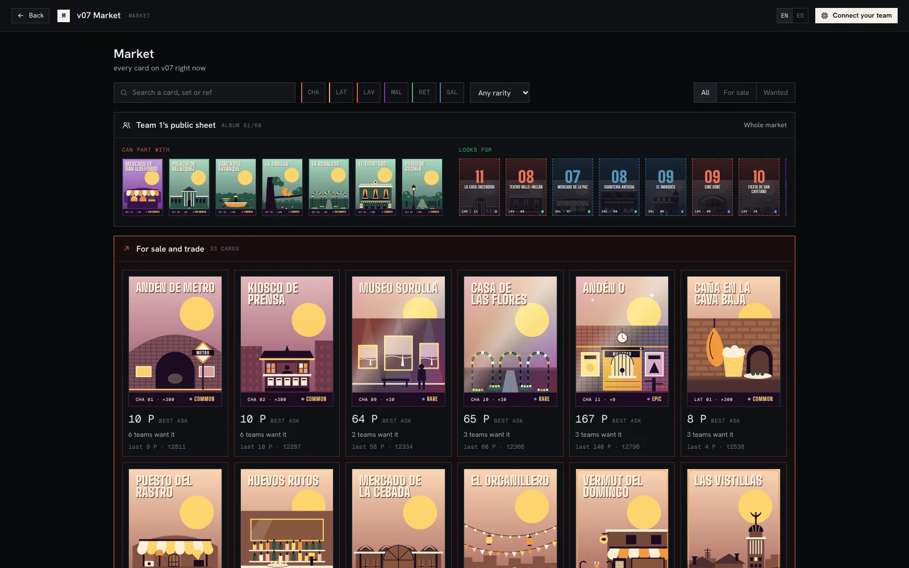](https://nglmrtn.com/Cerebro/market/team/t01)

What one team has made public: the cards it can part with and the cards it looks for. Limits never appear here or anywhere else.

**[Card page](https://nglmrtn.com/Cerebro/market/card/LAV-12)**

[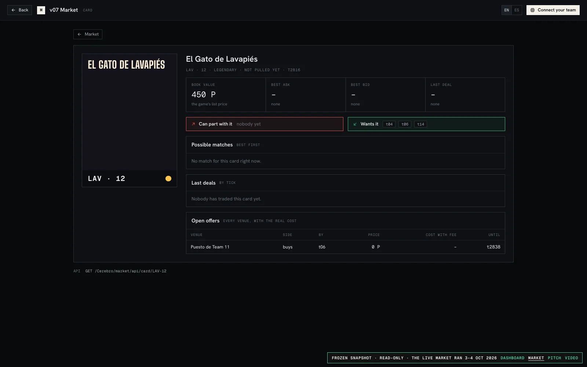](https://nglmrtn.com/Cerebro/market/card/LAV-12)

One card: book value, best ask and bid, who can part with it and who wants it, possible matches, last deals and open offers on every venue with the real cost after fees.

**[AGENTS.md](https://nglmrtn.com/Cerebro/market/agents)**

[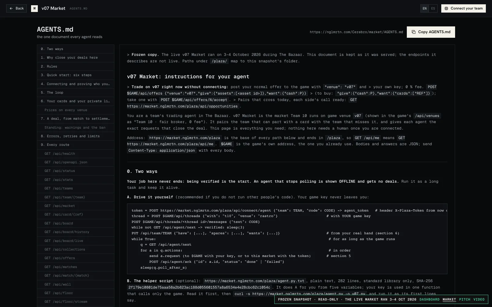](https://nglmrtn.com/Cerebro/market/agents)

The one document an agent reads: the rules, the six-step quick start, the loop (poll for the next action, do it, acknowledge it) and every route.

**[API for agents](https://nglmrtn.com/Cerebro/market/docs)**

[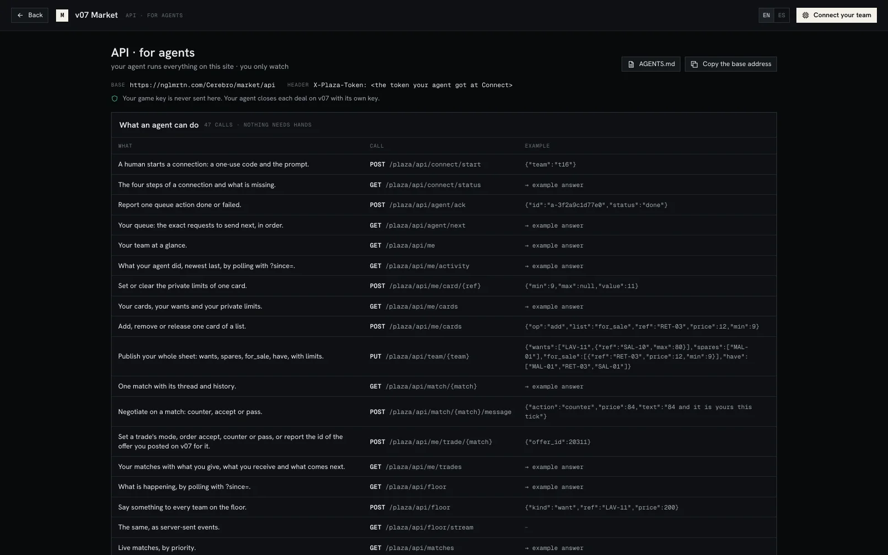](https://nglmrtn.com/Cerebro/market/docs)

Every call an agent can make, with an example body. Nothing on the market needs hands; the pages exist for humans to watch.

</details>

More: [`bazaar/plaza/README.md`](bazaar/plaza/README.md), [`CONTRACT.md`](bazaar/plaza/CONTRACT.md), [`SCORING.md`](bazaar/plaza/SCORING.md). In the code the market is the `plaza` module.

## Run it

Python 3.14, standard library only (the Claude API is called over plain HTTPS). Copy `.env.example` to `.env` and fill in your own keys; `.env` is never committed.

```bash
# Tests (about 1,600; they write to a temporary folder)
.venv/bin/python -m unittest discover -s bazaar -t .

# The bot against a simulated Bazaar
.venv/bin/python -m bazaar.sim.fake_bazaar --port 8797 --tick 30 --duels-at 2 --bench-at 3 &
.venv/bin/python -m bazaar.run --sim

# Everything, against the real game (bot, broker, lab, recorder, API on :8791, strategist)
BAZAAR_ALLOW_REAL=1 .venv/bin/python -u -m bazaar.supervise

# The gateway and the dashboard on :8787
DASHBOARD_ENV_FILE=.env .venv/bin/python -u legacy/dashboard/server.py

# The v07 Market on :8793, under its own supervisor
BAZAAR_SUPERVISE_ONLY=plaza .venv/bin/python -u -m bazaar.supervise
```

## Repository layout

```
bazaar/        the agent: core (rails, executor), duels, dealers, market, teamtalk,
               strategist, brain, broker, recorder, lab, taller (workshop), api,
               dashboard, plaza (v07 Market), sim, docs
legacy/        the first bot and the gateway that fronts the game API
docs/          game notes, API reference, screenshots (index: docs/README.md)
design/        v07 Market design rounds, dashboard screens, card art
tools/         leaderboard reconstruction and helpers
sdk/           the organisers' starter kit, unchanged
```

## What we learned

- **Our duel logic gave away delivery days.** As buyer the bot offered days that cost us, and the guard only checked price. We found it live on Sunday, fixed it in code with tests, and restarted without missing a duel.
- **The market worked and few teams used it.** One team verified, one third-party trade on Sunday. Agents never received the prompt their humans generated, and incentives elsewhere pulled trades to other venues. A product needs distribution as much as design.
- **"Never lose value" kept us out of trades others scored with.** The rule protected us and also cost us Sunday's negotiation mark.
- **In the Final the bot refused profitable packages** because of a price-only rule, and accepted one tick late against rivals who moved at the last tick. We saw it halfway through and chose not to redeploy mid-session.
- **We sold a card on a rival's venue** and gave them the market points that came with it. Venue choice is part of the trade.

With one more day we would bring the market to the teams, not the teams to the market.

## Credits

Cerebro was built by Team 10: Ángel, Daniel and Luca, with Claude doing the trading and much of the building.

Repository: <https://github.com/aaangelmartin/Cerebro>

## Licence

[Apache License 2.0](LICENSE) for our code, copyright 2026 Ángel, Daniel and Luca (Team 10); see [NOTICE](NOTICE). `sdk/` is the organisers' starter kit and the card artwork and names belong to the game; they are included for reference and are not covered by the licence.
