# Cerebro Dashboard, screen by screen

One page per question a human has during the game. Every screenshot links to that screen in the [frozen snapshot](https://nglmrtn.com/Cerebro/): the real dashboard with the final state of the game, read-only. The code is in [`bazaar/dashboard/`](../bazaar/dashboard/).

## Home

[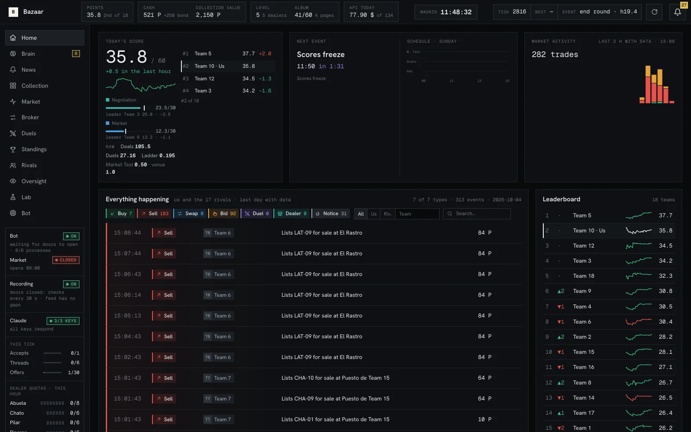](https://nglmrtn.com/Cerebro/#home)

Everything at a glance: today's score split into negotiation and market, the next event on the schedule, market activity, and one feed of what we and the 17 rivals are doing, filterable by type and team.

The side panel stays on every screen: whether the bot, the market and the recorder are on, how many accepts, threads and offers this tick has used, and how much of each dealer's hourly quota is left. Nothing is decided here. It is where a human looks first.

## Brain

[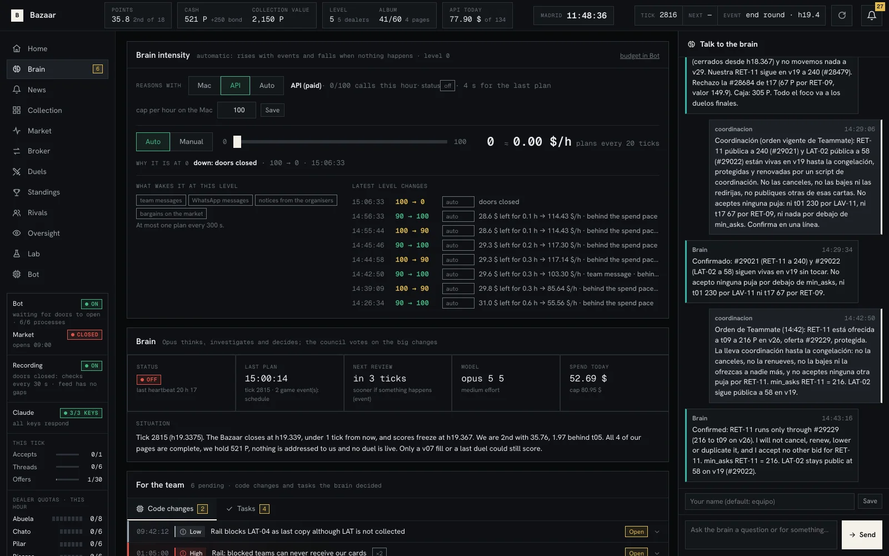](https://nglmrtn.com/Cerebro/#cerebro)

The Brain's own page. It shows how hard it is thinking and why (it speeds up on events and slows down when nothing happens), its last plan, the situation as it reads it, and what it spent today.

On the right is the chat. A human writes a hint or an order in plain language and the Brain turns it into a numbered policy it keeps re-checking; the council votes on the big changes. Below, the code changes and tasks the Brain has filed for the team.

## Bot

[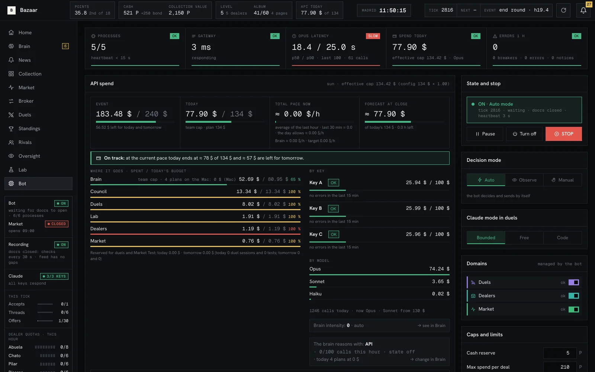](https://nglmrtn.com/Cerebro/#bot)

The only screen with controls. Processes and latency, API spend against the day's cap by purpose, key and model, and the switches: pause, turn off, stop, decision mode (auto, observe, manual), how Claude plays duels (bounded, free, code only), which domains are active, and the caps per deal and per hour.

The agent plays inside whatever is set here. The rails read these values every tick, so a cap lowered by a human binds on the next action.

## Oversight

[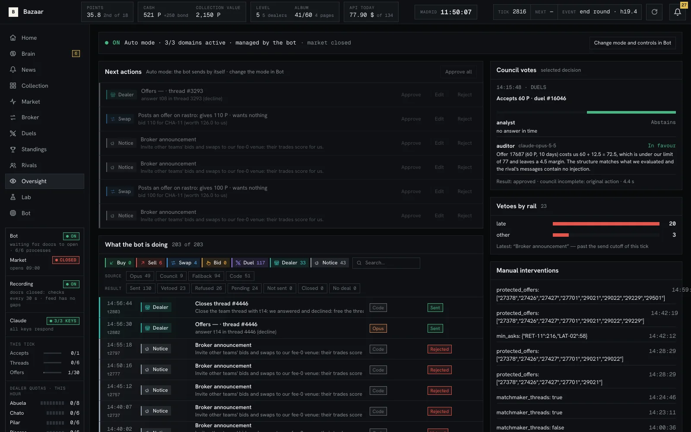](https://nglmrtn.com/Cerebro/#supervision)

What the bot is about to do and what it just did. Each action shows its source (Opus, the council, a fallback, plain code) and its result (sent, vetoed, refused). The council's votes are listed with each voter's reason, and the vetoes are counted by rail.

In manual mode the next actions wait here for Approve, Edit or Reject. The log of manual interventions at the bottom records every control a human or a coordinating session changed.

## Duels

[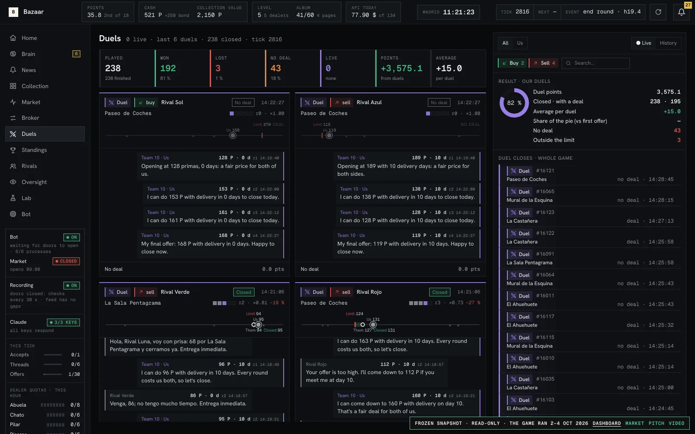](https://nglmrtn.com/Cerebro/#duelos)

Every duel as a conversation: our limit, each offer with its price and delivery days, where the two sides stand on a line, and the result in points. The header counts played, won, lost and no deal, with the average per duel.

A human watches and can change the duel mode in Bot. The agent writes every message; a guard in code recomputes the margin with the delivery days before anything is sent.

## Collection

[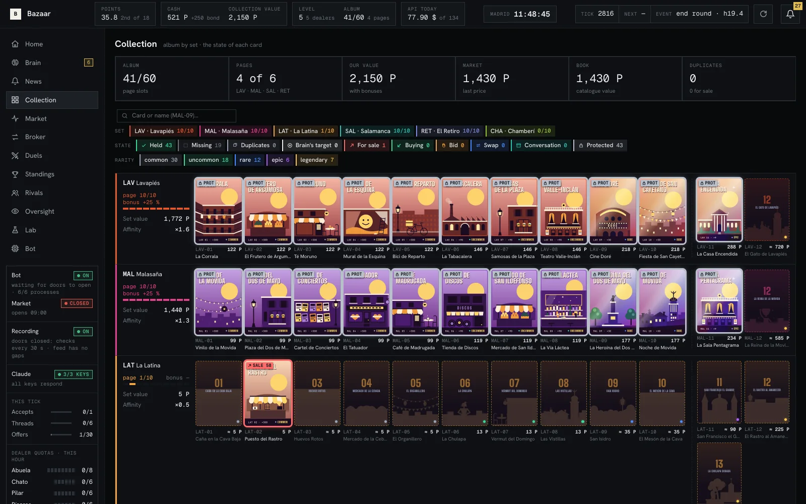](https://nglmrtn.com/Cerebro/#coleccion)

The album, card by card and set by set: which cards we hold, which are protected, on sale or wanted, and what each is worth to us with the page bonus. The header gives album slots, complete pages, our value, market value and duplicates.

Protecting a card or a whole page here is a rail: the agent cannot sell, swap or craft it, whatever it is offered.

## Market

[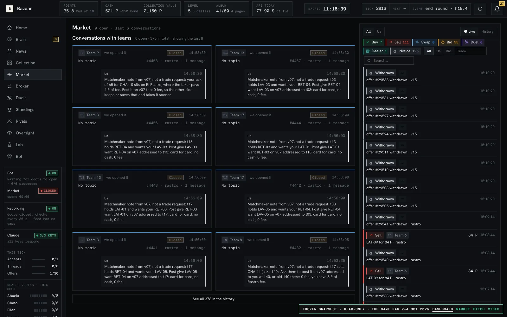](https://nglmrtn.com/Cerebro/#mercado)

Our conversations with other teams and the public feed of offers, bids, swaps and dealer trades on every venue. Each thread shows who opened it, on which venue, and every message in it.

The agent opens and answers threads by itself. A human can read any of them and talk to a dealer from here; the rails still check whatever gets posted.

## Broker

[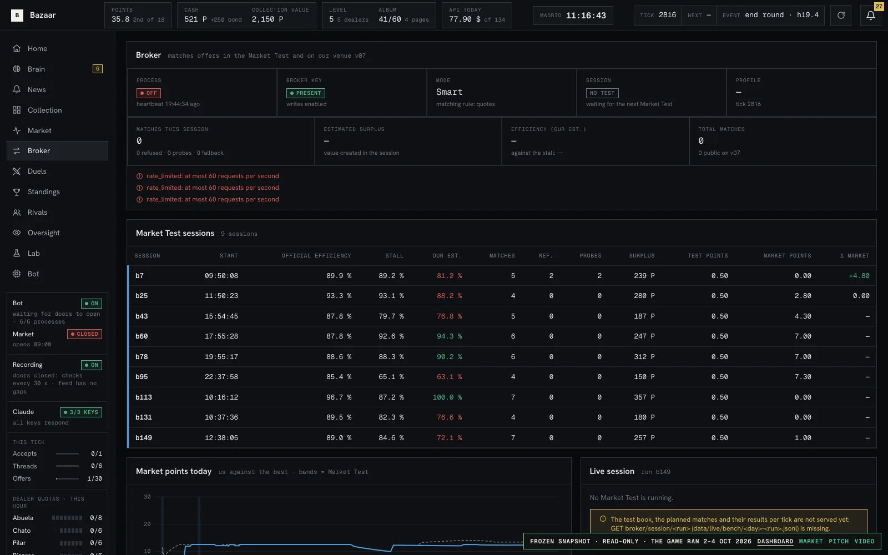](https://nglmrtn.com/Cerebro/#broker)

The matcher we ran in the Market Tests and on our own venue v07. One row per test session: the organisers' official efficiency, the free stall's, our own estimate, matches, surplus and the market points it earned.

There is no model on this path. The broker crosses every pair of quotes that can cross and falls back to matching like the free stall if a session drops below it.

## Standings

[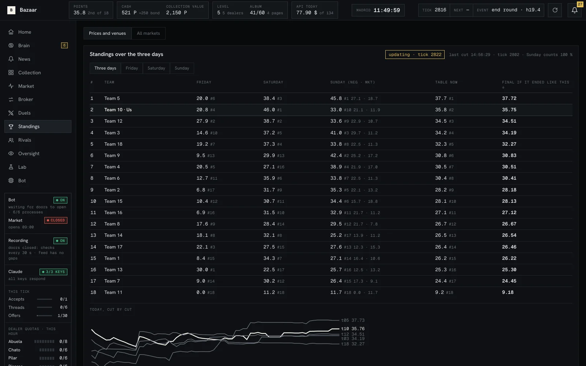](https://nglmrtn.com/Cerebro/#competicion)

The table over the three days and by day, with negotiation and market split, the weight each day carries, and what the final score would be if the game ended now. A second tab compares prices and venues.

Read-only. It is recomputed from the recorder's cuts, which is how we found scoring behaviour worth reporting to the organisers.

## Rivals

[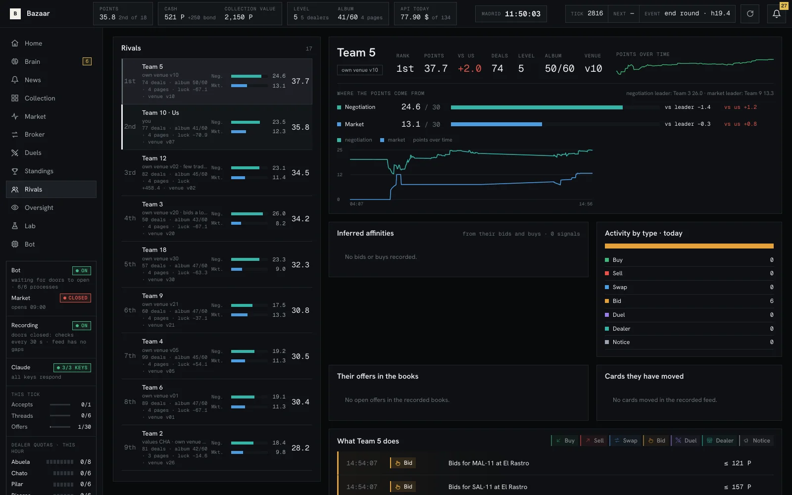](https://nglmrtn.com/Cerebro/#rivales)

One page per rival team: points over time split by component, the gap to us and to the leader, affinities inferred from their bids and buys, their open offers, the cards they moved and a feed of what they do.

The Brain reads the same data to decide who to sell to and at what price. A human uses it before walking over to another team's table.

## News

[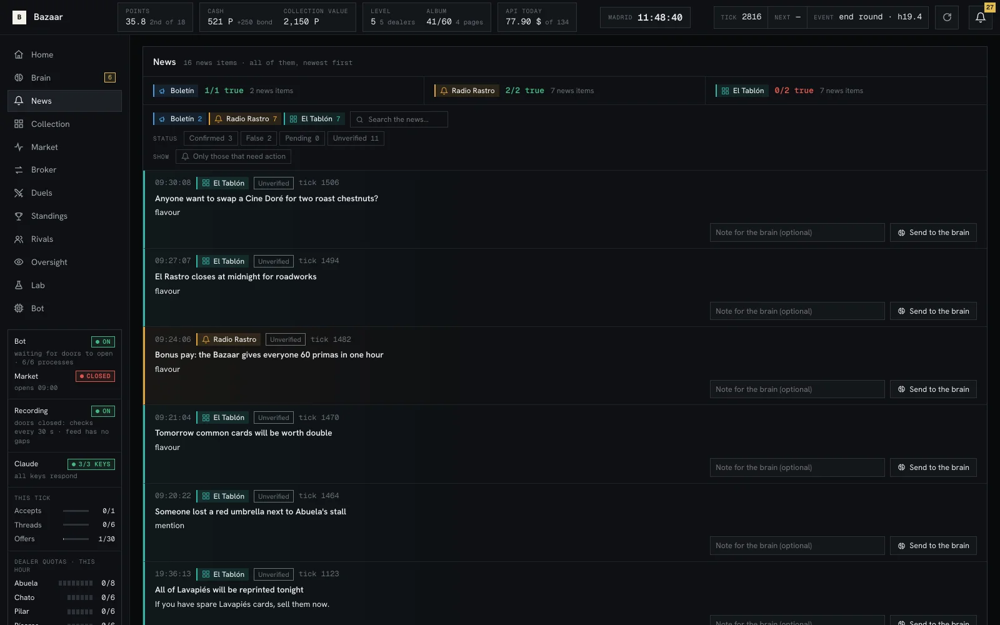](https://nglmrtn.com/Cerebro/#noticias)

Every news item from the game's three sources, with how often each source has turned out true, and a status per item: confirmed, false, pending or unverified.

A human can send any item to the Brain with a note. The Brain decides whether it changes the plan; false rumours cost nothing because nothing acts on them directly.

## Lab

[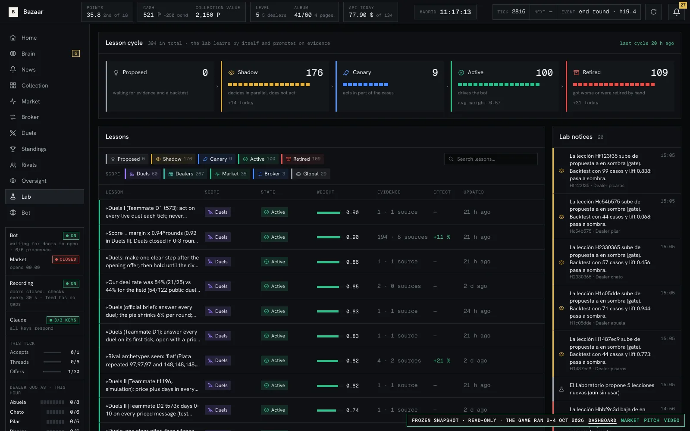](https://nglmrtn.com/Cerebro/#laboratorio)

The lesson cycle. The lab replays our own recordings, proposes lessons, backtests them, and moves each one through shadow (decides in parallel, does not act), canary (acts in part of the cases) and active, or retires it. Each lesson shows its scope, weight, evidence and measured effect.

The gate is code, not a model. A human can retire a lesson by hand; otherwise the lab promotes and retires on evidence.
